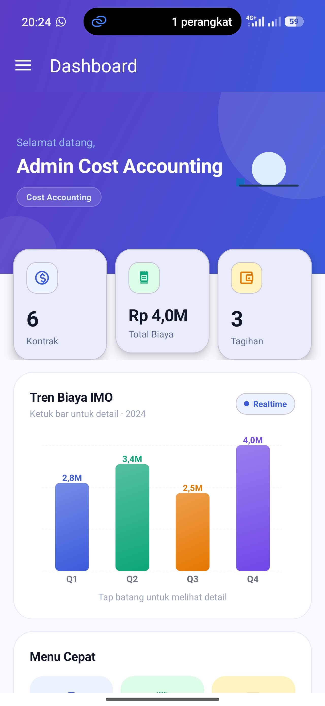
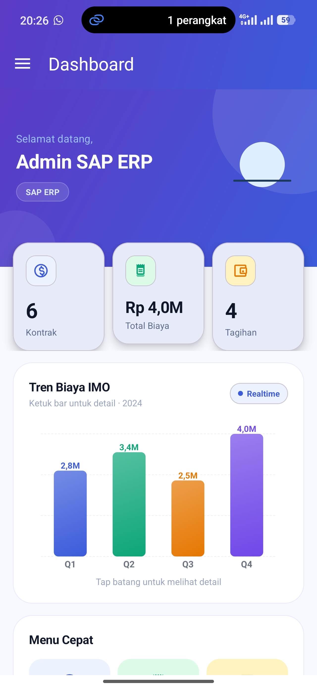

# SIMO — Sistem Infrastructure, Maintenance & Operation

> **Aplikasi Mobile Android Native untuk PT Kereta API Indonesia (Persero)**  
> Prototipe Akademik | Ujian Akhir Semester Pemrograman Mobile 1

---

## 📋 Deskripsi Singkat

**SIMO** adalah aplikasi mobile Android Native yang dirancang untuk manajemen operasional dan maintenance infrastruktur PT Kereta API Indonesia (Persero). Aplikasi ini memungkinkan tiga role pengguna (Cost Accounting, SAP ERP, DJKA) untuk:

- 📊 Mengelola pekerjaan maintenance dengan status tracking real-time
- 💰 Mengelola biaya operasional dan revenue tracking  
- ✅ Verifikasi dan approval tagihan/invoice
- 🔄 Sinkronisasi data master SDM dan aset infrastruktur
- 🔐 Akses terpisah berdasarkan role dengan Row-Level Security

**Status:** Prototipe Akademik — Semua data dummy, tanpa aset asli PT KAI

---

## 👥 Tim Pengembang

| No | Nama | NIM | Peran |
|:--:|------|-----|-------|
| 1 | **Adrian** | 24552011294 | Backend Integration & Database Architecture |
| 2 | **Ahmad Kurnia** | 24552011297 | UI/UX & Frontend Development |
| 3 | **Fajar Fathurrahman** | 24552011198 | Architecture & Dependency Injection |
| 4 | **Mahesa Satriaa Darussalam** | 24552011321 | Feature Development & QA |

---

## 🎥 Video Penjelasan Project

**📺 [YouTube — Tonton Video Penjelasan Lengkap]**  
*(Link akan diupdate setelah video di-upload)*

Video mencakup:
- ✅ Perkenalan semua anggota kelompok (wajah terlihat, peran masing-masing)
- ✅ Demo aplikasi lengkap (login, semua fitur per role, CRUD operations)
- ✅ Penjelasan singkat alur kode (CRUD, RecyclerView, Coroutines & Flow)

---

## 🎥 Dokumentasi

### Dashboard Admin SAP ERP
|:---:|:---:|
|  |  |


## ✨ Fitur Utama

### 🔑 1. Authentication & Authorization
```
✓ Login berbasis email/password dengan Supabase Auth
✓ 3 role dengan permission berbeda (Role-Based Access Control)
✓ Row-Level Security (RLS) di backend untuk data privacy
✓ Demo credentials untuk testing (ca@kai.id, djka@kai.id, sap@kai.id)
```

### 📊 2. Cost Accounting Dashboard
```
✓ Dashboard dengan statistik operasional:
  - Total biaya maintenance
  - Jumlah job aktif
  - Revenue tracking
  
✓ CRUD Maintenance Jobs:
  - Create: Tambah job baru
  - Read: Lihat list job dengan pagination
  - Update: Edit status (Pending → In Progress → Completed)
  - Delete: Hapus job jika perlu
  
✓ Search & Filter functionality
✓ Real-time status updates
```

### ✔️ 3. DJKA Verification Module
```
✓ View pending invoices/tagihan untuk verifikasi
✓ Approve atau Reject dengan alasan/notes
✓ Audit trail untuk setiap perubahan status
✓ Read-only access ke data operasional (tidak bisa edit/delete)
✓ Real-time notification untuk perubahan status
```

### 🔗 4. SAP ERP Integration
```
✓ Sinkronisasi master data SDM (karyawan, departemen, posisi)
✓ Sinkronisasi data aset infrastruktur (lokasi, equipment, kondisi)
✓ View tabel aset dengan detail linked data
✓ Real-time synchronization dari Supabase backend
✓ Pull-to-refresh untuk manual sync
✓ Permission handling: SAP hanya bisa view, tidak ada edit/delete
```

### 🔄 5. Real-Time Updates
```
✓ Kotlin Flow & StateFlow untuk reactive UI
✓ Real-time data streaming dari Supabase
✓ Optimistic UI updates untuk better UX
✓ Proper lifecycle handling dengan repeatOnLifecycle
```

---

## 🏗️ Alur Aplikasi

```
┌─────────────────────────────────────────────────────────────────┐
│  SPLASH SCREEN → LOGIN SCREEN (with demo credentials)          │
└──────────────────────┬──────────────────────────────────────────┘
                       │
                       ▼
     ┌─────────────────────────────────────────┐
     │  Supabase Auth + Role Check (RLS)       │
     │  Verifikasi kredensial & permission     │
     └──┬──────────────────────┬───────────┬───┘
        │                      │           │
   ┌────▼─────┐    ┌──────────▼──┐   ┌────▼────┐
   │  CA Role │    │  DJKA Role  │   │SAP Role │
   └────┬─────┘    └──────┬──────┘   └────┬────┘
        │                 │              │
   ┌────▼────────────────▼──────────────▼────┐
   │  MAIN DASHBOARD & OPERATIONS             │
   │  - RecyclerView List (CRUD operations)   │
   │  - Detail Screen (view/edit/delete)      │
   │  - Search & Filter                       │
   └────┬──────────────┬──────────────┬───────┘
        │              │              │
   ┌────▼──┐    ┌─────▼──────┐  ┌────▼─────┐
   │ Local │    │  Supabase  │  │Coroutines│
   │ Cache │    │  PostgREST │  │& Flow    │
   └───────┘    └────────────┘  └──────────┘
        │              │              │
        └──────────────┴──────────────┘
               (Real-time sync)
```

**Flow Detail:**
1. **Login** → Supabase Auth (email/password)
2. **Authorization** → Backend RLS menentukan role & data access
3. **Dashboard Load** → Repository fetch data via PostgREST API
4. **UI Rendering** → RecyclerView + ViewBinding display data
5. **User Action** → CRUD operation → ViewModel → Repository
6. **API Call** → Supabase update data + RLS validation
7. **Real-time Update** → Flow/StateFlow notify UI → RecyclerView refresh

---

## 📁 Struktur Proyek

```
SIMO/
│
├── app/
│   ├── src/main/
│   │   ├── java/com/kelompok1/simo/
│   │   │   │
│   │   │   ├── ui/                          # UI LAYER
│   │   │   │   ├── auth/
│   │   │   │   │   ├── LoginActivity.kt
│   │   │   │   │   ├── LoginViewModel.kt
│   │   │   │   │   └── SplashActivity.kt
│   │   │   │   │
│   │   │   │   ├── main/
│   │   │   │   │   ├── MainActivity.kt
│   │   │   │   │   └── MainViewModel.kt
│   │   │   │   │
│   │   │   │   ├── ca/                      # Cost Accounting screens
│   │   │   │   │   ├── DashboardFragment.kt
│   │   │   │   │   ├── JobListFragment.kt
│   │   │   │   │   ├── JobDetailFragment.kt
│   │   │   │   │   ├── CreateJobFragment.kt
│   │   │   │   │   └── CAViewModel.kt
│   │   │   │   │
│   │   │   │   ├── djka/                    # DJKA screens
│   │   │   │   │   ├── InvoiceListFragment.kt
│   │   │   │   │   ├── InvoiceDetailFragment.kt
│   │   │   │   │   └── DJKAViewModel.kt
│   │   │   │   │
│   │   │   │   └── sap/                     # SAP ERP screens
│   │   │   │       ├── AssetListFragment.kt
│   │   │   │       ├── SDMListFragment.kt
│   │   │   │       └── SAPViewModel.kt
│   │   │   │
│   │   │   ├── domain/                      # DOMAIN LAYER
│   │   │   │   ├── model/
│   │   │   │   │   ├── User.kt
│   │   │   │   │   ├── MaintenanceJob.kt
│   │   │   │   │   ├── Invoice.kt
│   │   │   │   │   ├── Asset.kt
│   │   │   │   │   └── SDMData.kt
│   │   │   │   │
│   │   │   │   ├── repository/
│   │   │   │   │   ├── AuthRepository.kt
│   │   │   │   │   ├── JobRepository.kt
│   │   │   │   │   ├── InvoiceRepository.kt
│   │   │   │   │   └── AssetRepository.kt
│   │   │   │   │
│   │   │   │   └── usecase/                 # Business logic
│   │   │   │       ├── LoginUseCase.kt
│   │   │   │       ├── GetJobsUseCase.kt
│   │   │   │       └── ... (other usecases)
│   │   │   │
│   │   │   ├── data/                        # DATA LAYER
│   │   │   │   ├── remote/
│   │   │   │   │   ├── SupabaseAuthService.kt
│   │   │   │   │   ├── JobApiService.kt
│   │   │   │   │   └── SupabaseConfig.kt
│   │   │   │   │
│   │   │   │   ├── local/
│   │   │   │   │   ├── PreferencesManager.kt
│   │   │   │   │   └── LocalCache.kt
│   │   │   │   │
│   │   │   │   ├── mapper/
│   │   │   │   │   ├── JobMapper.kt
│   │   │   │   │   ├── UserMapper.kt
│   │   │   │   │   └── ... (other mappers)
│   │   │   │   │
│   │   │   │   └── repository/
│   │   │   │       ├── AuthRepositoryImpl.kt
│   │   │   │       ├── JobRepositoryImpl.kt
│   │   │   │       └── ... (implementations)
│   │   │   │
│   │   │   ├── di/                         # DEPENDENCY INJECTION (Hilt)
│   │   │   │   ├── AppModule.kt
│   │   │   │   ├── RepositoryModule.kt
│   │   │   │   ├── NetworkModule.kt
│   │   │   │   └── UseCaseModule.kt
│   │   │   │
│   │   │   ├── util/
│   │   │   │   ├── Constants.kt
│   │   │   │   ├── Extensions.kt
│   │   │   │   ├── DateUtils.kt
│   │   │   │   ├── CurrencyFormatter.kt
│   │   │   │   └── Logger.kt
│   │   │   │
│   │   │   └── MyApplication.kt             # Hilt Application class
│   │   │
│   │   └── res/
│   │       ├── layout/
│   │       │   ├── activity_login.xml
│   │       │   ├── activity_main.xml
│   │       │   ├── fragment_dashboard.xml
│   │       │   ├── fragment_job_list.xml
│   │       │   ├── item_job.xml
│   │       │   └── ... (other layouts)
│   │       │
│   │       ├── drawable/
│   │       │   ├── ic_user.xml
│   │       │   ├── ic_job.xml
│   │       │   ├── bg_login_pattern.xml
│   │       │   └── ... (other drawables)
│   │       │
│   │       ├── color/
│   │       │   └── colors.xml
│   │       │
│   │       ├── values/
│   │       │   ├── strings.xml
│   │       │   ├── dimens.xml
│   │       │   └── styles.xml
│   │       │
│   │       ├── mipmap/
│   │       │   └── ic_launcher.png
│   │       │
│   │       └── anim/
│   │           └── anim_train.json (Lottie)
│   │
│   ├── build.gradle.kts
│   ├── local.properties
│   └── ...
│
├── docs/
│   ├── Laporan_OOAD_SIMO_PT_KAI.pdf        # Laporan OOAD lengkap
│   ├── Class_Diagram.drawio
│   ├── Use_Case_Diagram.drawio
│   └── Database_Schema.sql
│
├── apk/
│   └── app-release.apk                      # Release APK
│
├── build.gradle.kts
├── settings.gradle.kts
├── gradle.properties
│
└── README.md                                 # File ini
```

---

## 💻 Teknologi yang Digunakan

### 🎯 Platform & Language
- **Platform:** Android Native (Kotlin)
- **Min SDK:** Android 8 (API 26)
- **Target SDK:** Android 14 (API 34)
- **Kotlin Version:** 1.9+

### 🏛️ Architecture & Design Patterns
| Pattern | Implementasi | Alasan |
|---------|-------------|--------|
| **MVVM** | Activity/Fragment → ViewModel → Repository | Separation of concerns, testable |
| **Repository** | Data abstraction layer | Hide implementation details |
| **Dependency Injection** | Hilt DI container | Loose coupling, easy mocking |
| **Use Case** | Business logic layer | Domain-specific logic |
| **Adapter** | RecyclerView Adapter pattern | Efficient list rendering |

### ⚡ Async & Reactive
- **Coroutines:** Kotlin Coroutines untuk non-blocking operations
- **Flow:** Kotlin Flow + StateFlow untuk reactive data streams
- **Lifecycle-aware:** `repeatOnLifecycle` untuk proper scope management

### 🗄️ Backend & Database
- **Backend:** Supabase (PostgreSQL cloud)
- **API:** PostgREST Kotlin Client
- **Auth:** Supabase Auth (email/password)
- **Security:** Row-Level Security (RLS) policies
- **Real-time:** WebSocket support via Supabase realtime

### 🎨 UI & Design System
- **Design System:** Material Design 3
- **Layout:** XML layouts + ViewBinding
- **Components:** 
  - MaterialCardView (cards)
  - MaterialButton (buttons)
  - TextInputLayout (text fields)
  - RecyclerView (lists)
  - FragmentTransaction (navigation)
- **Animation:** Lottie (animated vectors)
- **Color Palette:**
  - Primary: `#1B3A5B`
  - Secondary: `#E67E22`
  - Background: `#F5F7FA`
  - Success: `#2E7D32`
  - Warning: `#F9A825`
  - Error: `#C62828`

### 📦 Key Dependencies

```gradle
// Supabase
implementation("io.github.supabase:supabase-kt:2.5.0") {
    include "gotrue-kt", "postgrest-kt", "storage-kt"
}
implementation("io.ktor:ktor-client-android:2.3.0")
implementation("org.jetbrains.kotlinx:kotlinx-serialization-json:1.6.0")

// Android Architecture Components
implementation("androidx.lifecycle:lifecycle-viewmodel-ktx:2.6.1")
implementation("androidx.lifecycle:lifecycle-runtime-ktx:2.6.1")

// Hilt for Dependency Injection
implementation("com.google.dagger:hilt-android:2.48")
kapt("com.google.dagger:hilt-compiler:2.48")

// Coroutines
implementation("org.jetbrains.kotlinx:kotlinx-coroutines-android:1.7.2")

// Material Design 3
implementation("com.google.android.material:material:1.11.0")

// ViewBinding (included in Android Studio)
// Lottie Animations
implementation("com.airbnb.android:lottie:6.1.0")

// Logging
implementation("com.jakewharton.timber:timber:5.0.1")
```

---

## 🚀 Cara Menjalankan Aplikasi

### 📋 Prerequisites
- Android Studio (Giraffe 2022.3.1 atau lebih baru)
- JDK 11 atau lebih baru
- Android Emulator (API 26+) atau Physical Device
- Git

### 🔧 Setup Steps

#### 1. Clone Repository
```bash
git clone https://github.com/Kelompok1/SIMO.git
cd SIMO
```

#### 2. Setup Supabase Credentials
Buat file `local.properties` di root project:
```properties
SUPABASE_URL=https://your-project.supabase.co
SUPABASE_ANON_KEY=your_anon_key_here
```

**Catatan:** Jangan commit `local.properties` ke GitHub (sudah ada di `.gitignore`)

#### 3. Open di Android Studio
```bash
# Buka project di Android Studio
open -a "Android Studio" .

# Atau manual: File → Open → pilih folder SIMO
```

#### 4. Build & Run
```bash
# Sync Gradle dependencies
# Tombol: Sync Now di Android Studio

# Run aplikasi
# Tekan Shift + F10 atau Run → Run 'app'
```

#### 5. Login dengan Demo Credentials
Gunakan salah satu akun berikut:

| Role | Email | Password | NIM |
|------|-------|----------|-----|
| Cost Accounting | `ca@kai.id` | `demo123` | 24552011294 |
| DJKA | `djka@kai.id` | `demo123` | 24552011297 |
| SAP ERP | `sap@kai.id` | `demo123` | 24552011198 |

---

## 📚 Penjelasan Singkat Alur Kode

### 1️⃣ **CRUD Flow — Create, Read, Update, Delete**

```kotlin
// USER INTERACTION
binding.btnCreateJob.setOnClickListener {
    val job = MaintenanceJob(...)
    viewModel.createJob(job)  // User submit form
}

// VIEWMODEL
fun createJob(job: MaintenanceJob) {
    viewModelScope.launch {
        val result = createJobUseCase.execute(job)
        _state.value = result  // Update UI state
    }
}

// REPOSITORY
fun createJob(job: MaintenanceJob): Flow<Result<MaintenanceJob>> = flow {
    emit(Result.Loading)
    val response = supabaseClient.postgrest["maintenance_jobs"]
        .insert(JobDto.fromDomain(job))
    emit(Result.Success(response.toDomain()))
}

// DATABASE (Supabase)
INSERT INTO maintenance_jobs (id, name, status, cost, created_by)
VALUES (...) RETURNING *;
```

**Flow:** UI Event → ViewModel → UseCase → Repository → Supabase API → Response → StateFlow → UI Recompose

---

### 2️⃣ **RecyclerView & Adapter Pattern**

```kotlin
// ADAPTER (menggunakan ViewBinding)
class JobAdapter(
    private val onJobClick: (MaintenanceJob) -> Unit
) : RecyclerView.Adapter<JobAdapter.ViewHolder>() {

    private val jobs = mutableListOf<MaintenanceJob>()

    override fun onCreateViewHolder(parent: ViewGroup, viewType: Int): ViewHolder {
        val binding = ItemJobBinding.inflate(
            LayoutInflater.from(parent.context), parent, false
        )
        return ViewHolder(binding)
    }

    override fun onBindViewHolder(holder: ViewHolder, position: Int) {
        holder.bind(jobs[position])
    }

    override fun getItemCount() = jobs.size

    fun updateJobs(newJobs: List<MaintenanceJob>) {
        jobs.clear()
        jobs.addAll(newJobs)
        notifyDataSetChanged()
    }

    inner class ViewHolder(private val binding: ItemJobBinding) :
        RecyclerView.ViewHolder(binding.root) {
        
        fun bind(job: MaintenanceJob) {
            binding.apply {
                tvJobName.text = job.name
                tvStatus.text = job.status
                tvCost.text = formatCurrency(job.cost)
                root.setOnClickListener { onJobClick(job) }
            }
        }
    }
}

// USAGE (di Fragment)
lifecycleScope.launch {
    repeatOnLifecycle(Lifecycle.State.STARTED) {
        viewModel.jobsFlow.collect { jobs ->
            adapter.updateJobs(jobs)
        }
    }
}
```

**Keuntungan:**
- ✅ ViewBinding → type-safe view references
- ✅ Adapter caching → efficient rendering
- ✅ Flow collection → reactive updates

---

### 3️⃣ **Coroutines & State Management**

```kotlin
// VIEWMODEL
@HiltViewModel
class CAViewModel @Inject constructor(
    private val jobRepository: JobRepository
) : ViewModel() {

    private val _jobsState = MutableStateFlow<List<MaintenanceJob>>(emptyList())
    val jobsState: StateFlow<List<MaintenanceJob>> = _jobsState

    init {
        loadJobs()
    }

    private fun loadJobs() {
        viewModelScope.launch {
            jobRepository.getJobs()
                .catch { _jobsState.value = emptyList() }
                .collect { jobs -> _jobsState.value = jobs }
        }
    }
}

// ACTIVITY/FRAGMENT (UI LAYER)
class JobListFragment : Fragment() {
    private val viewModel: CAViewModel by viewModels()

    override fun onViewCreated(view: View, savedInstanceState: Bundle?) {
        super.onViewCreated(view, savedInstanceState)
        
        lifecycleScope.launch {
            repeatOnLifecycle(Lifecycle.State.STARTED) {
                viewModel.jobsState.collect { jobs ->
                    adapter.updateJobs(jobs)
                }
            }
        }
    }
}
```

**Penjelasan:**
- `viewModelScope.launch` → Coroutine scope terikat lifetime ViewModel
- `Flow.collect()` → Subscribe ke data stream (bisa cancel ketika lifecycle end)
- `repeatOnLifecycle` → Automatic restart collection ketika activity/fragment resume
- `StateFlow` → Latest value always available, efficient for UI

---

## 📖 Referensi OOAD

Project ini mengimplementasikan prinsip-prinsip Object-Oriented Analysis and Design (OOAD):

### 1. **Encapsulation** (Pembungkusan)
- Data access melalui Repository interface (hidden implementation)
- Private members, public methods
- Example: `JobRepositoryImpl` implements `JobRepository`

### 2. **Abstraction** (Penyederhanaan)
- Repository & UseCase interfaces untuk abstraction
- ViewModel menyembunyikan detail implementasi data layer
- User hanya interact dengan high-level operations

### 3. **Inheritance** (Pewarisan)
- ViewModel base class → CAViewModel, DJKAViewModel, SAPViewModel
- Activity/Fragment inheritance dari AppCompatActivity, Fragment
- Repository inheritance patterns

### 4. **Polymorphism** (Polimorfisme)
- Repository interface dengan multiple implementations
- Different behavior untuk setiap role (CA, DJKA, SAP)
- Adapter pattern untuk RecyclerView

### 5. **Dependency Injection** (Injeksi Ketergantungan)
- Hilt untuk loose coupling antar components
- Constructor injection untuk testability
- Eliminasi hard-coded dependencies

**Detail lengkap:** Lihat `docs/Laporan_OOAD_SIMO_PT_KAI.pdf`

---

## 📱 Screenshots

*(Screenshots akan ditambahkan setelah development complete)*

```
[Login Screen]          [CA Dashboard]        [Job List]
[DJKA Verification]     [SAP Master Data]     [Detail Screen]
```

---

## 🔐 Security & Best Practices

### Authentication & Authorization
- ✅ Email/password authentication via Supabase
- ✅ Role-Based Access Control (RBAC)
- ✅ Row-Level Security (RLS) di database
- ✅ Token-based session management

### Data Privacy
- ✅ RLS policies enforce data isolation per role
- ✅ Credentials tidak di-hardcode (local.properties)
- ✅ Secure storage untuk sensitive data

### Code Quality
- ✅ MVVM architecture untuk separation of concerns
- ✅ Repository pattern untuk data abstraction
- ✅ Dependency Injection untuk testability
- ✅ Coroutines best practices
- ✅ Proper lifecycle management

---

## 🐛 Known Issues & Limitations

1. **Demo Data:** Semua data dummy, tidak tersambung produksi PT KAI
2. **Prototipe:** Ini adalah prototipe akademik, bukan production-ready
3. **Offline Mode:** Belum ada offline-first support (harus online)
4. **Testing:** Unit tests & UI tests masih minimal

---

## 📞 Kontak & Informasi Pengembang

### 🎓 Informasi Akademik
- **Institusi:** Universitas Teknologi Bandung (UTB)
- **Departemen:** Teknik Informatika
- **Fakultas:** Industri Kreatif
- **Kelas:** TIF RP 24D CNS
- **Mata Kuliah:** Pemrograman Mobile 1 (3 SKS)
- **Dosen Pengampu:** Danny Aidil Rismayadi, S.SI., M.Kom.
- **Tahun Akademik:** 2026
- **Periode:** Ujian Akhir Semester (UAS)
- **Deadline:** 09 Juli 2026 (Take Home)

### 👨‍💻 Tim Pengembang

| No | Nama | NIM | GitHub | Email |
|:--:|------|-----|--------|-------|
| 1 | Adrian | 24552011294 | @adrian | - |
| 2 | Ahmad Kurnia | 24552011297 | @ahmadkurnia | - |
| 3 | Fajar Fathurrahman | 24552011198 | @fajar | - |
| 4 | Mahesa Satriaa Darussalam | 24552011321 | @mahesa | - |

## Kelompok TIF RP 24D CNS
- Anggota 1 Ahmad Kurnia ([Link Github](https://github.com/AhmadKurnia13))
- Anggota 2 Mahesa Satria Darussalam ([Link Github](https://github.com/looplipop/)
- Anggota 3 Fajar Fathurrohman [Link Github](https://github.com/fajarfathur)
- Anggota 4 Adrian [Link Github](https://github.com/adrianAsh199)

### 🔗 Links
- **GitHub Repository:** https://github.com/Kelompok1/SIMO
- **Video Penjelasan:** *(Coming Soon - YouTube Link)*
- **Laporan OOAD:** `docs/Laporan_OOAD_SIMO_PT_KAI.pdf`

📂 Dokumen Pendukung:
📄 Laporan OOAD: https://drive.google.com/drive/folders/11f4NNs3oI-ub07ap0DEd2fTDY9K-7YtN?usp=sharing
📸 Dokumentasi: https://drive.google.com/drive/folders/1EM4Q0Mb4UYHd5nc85Zu0k5xOlj9zc9Cl?usp=sharing

## Use Case Diagram Gambaran Proyek

---

## 📄 Lisensi

Project ini adalah **Prototipe Akademik** untuk keperluan UAS. Semua kode, dokumentasi, dan asset mengikuti lisensi yang ditentukan oleh institusi pendidikan.

---

## 🙏 Ucapan Terima Kasih

Terima kasih kepada:
- 🎓 **Erryck Norrys, S.Kom.** — Dosen Pengampu
- 🏫 **Universitas Teknologi Bandung** — Institusi Pendidikan
- 👥 **Kelompok 1 TIF RP 24D CNS** — Tim Pengembang
- 🚂 **PT Kereta API Indonesia** — Inspirasi Project

---

**Terima kasih telah menggunakan SIMO! Semoga aplikasi ini bermanfaat. 🙏**

---

*Last Updated: 09 July 2026*  
*Project Version: 1.0.0-academic*
