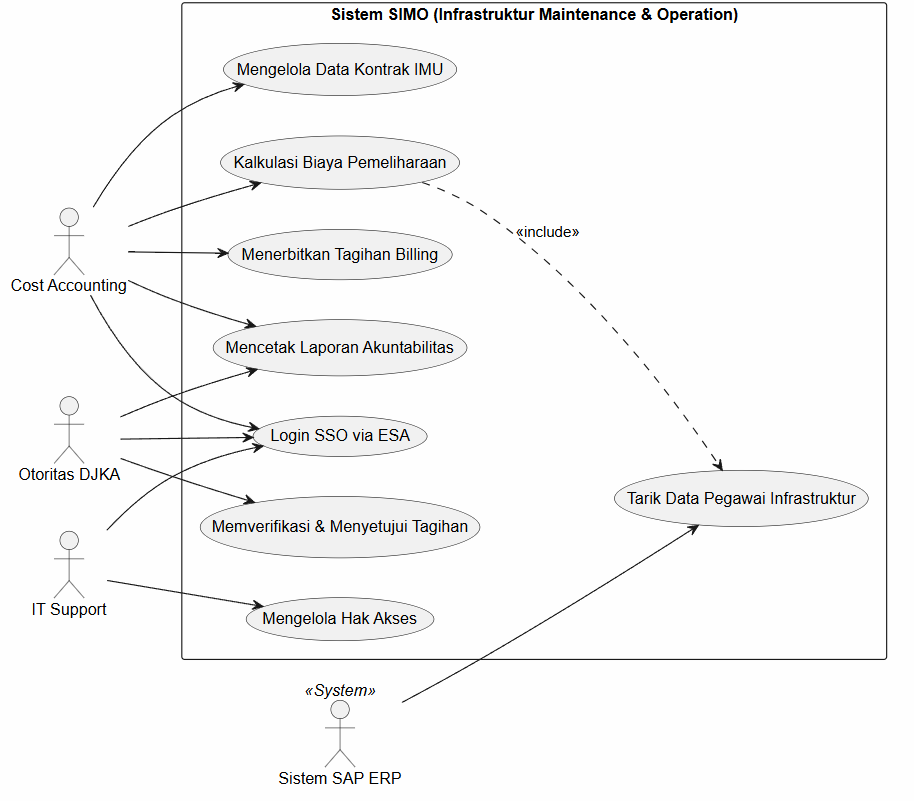
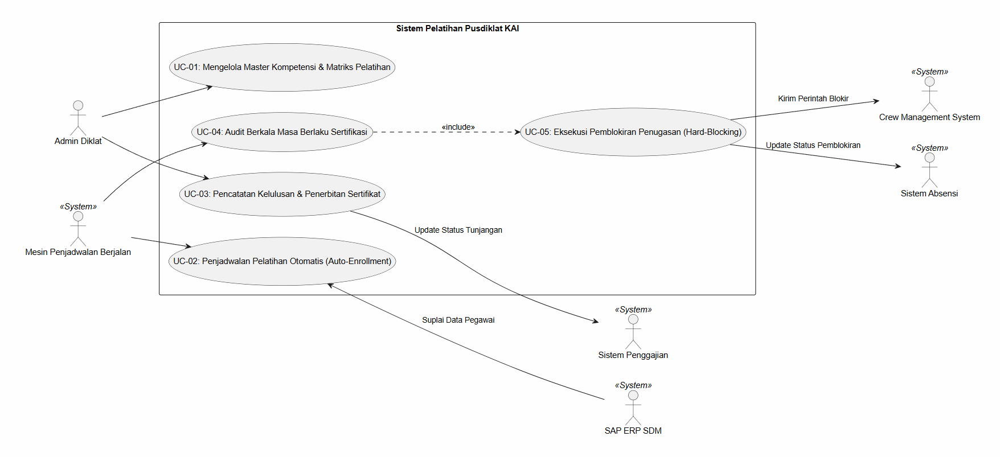
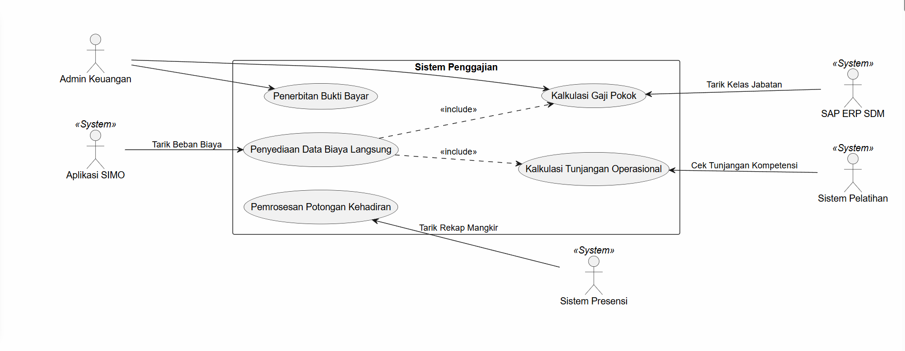
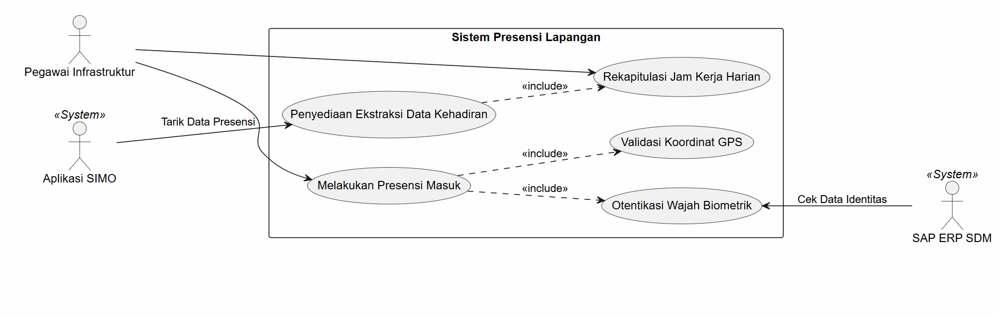

# SIMO Mobile - Aplikasi Manajemen Kompetensi Pegawai PT KAI

Aplikasi Android ini digunakan oleh internal Kru PT KAI (Masinis, Konduktor) untuk memantau validitas sertifikasi keselamatan kerja secara real-time.

## Kelompok TIF RP 24D CNS
- Anggota 1 Ahmad Kurnia ([Link Github](https://github.com/AhmadKurnia13))
- Anggota 2 Mahesa Satria Darussalam ([Link Github](https://github.com/looplipop/)
- Anggota 3 Fajar Fathurrohman [Link Github](https://github.com/fajarfathur)
- Anggota 4 Adrian [Link Github](https://github.com/adrianAsh199)

## Use Case Diagram Gambaran Proyek

